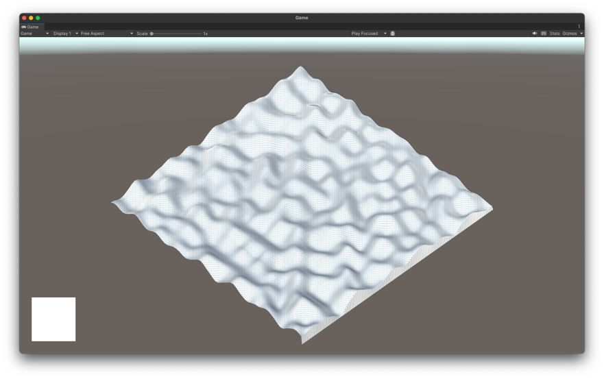

# Procedural Generation in Unity
This is a small project where I wanted to learn basics of Perlin Noise Generation and Terrain Generation in Unity.
In the future I want to implement it in the RTS Engine I'm working on with my team. It uses the MonoGame Framework, so making it in Unity will be a good practice. 

## Perlin Noise Generator
Perlin Noise is a type of gradient noise which is used to generate textures, landscapes, and other things.
In my first implementation I wanted to create a simple 2D Perlin Noise Generator which will generate a texture of this noise and display it on the screen.
Moreover, I added a terrain and modified it with the noise to create a simple terrain generation.

This first implementation uses the built in Unity Perlin Noise function (`Mathf.PerlinNoise`) to generate the noise.
It's okay for now but I want to create my own implementation of Perlin Noise in the next implementation.
Also, this noise generation lacks some features, like the octaves, which gives the noise more detail and realism.

This is how the first implementation looks like:

## Second Implementation
